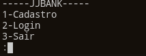

# jjBank

<p align="center">
  
</p>

## :scroll: Sobre

Sistema de Banco com as funcionalidades:

- Cadastrar usuário
- Logar
- Ver Perfil
- Realizar Depósito
- Visualizar Saldo
- Realizar Saque

---

## :rocket: Tecnologias utilizadas

- Python3
- MySQL/MariaDB

---

## :computer: Como baixar o projeto

```bash
  // Clonar o repositório
  $ git clone https://github.com/jjoaovitor7/jjBank

  // Entrar no diretório
  $ cd jjBank
  $ cd dist

  // (Linux)
  // Executar o servidor
  $ ./server
  // Executar o programa
  $ ./main
```

---
